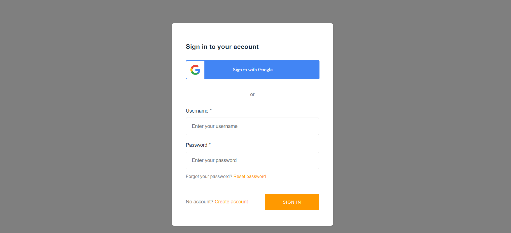
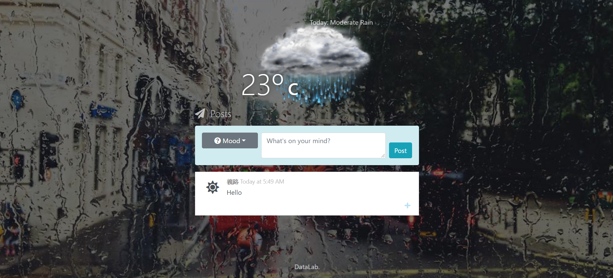

# Assignment - Weathermood Auth
In this assignment, you are asked to add basic authentication function to your website, using AWS Amplify.

## Requirement
1. (30%) Sign up/sign in with username and password.
2. (30%) Sign in with google account.

3. (20%) Custom greeting component, including username and logout button.

4. (20%) Show username in each post.

## Bonus
(20%) deploy on AWS with backend server

## Submit
1. One submission per team, submit to the branch of your team.
2. If you complete the bonus part, please note your url in your merge rquest. And make sure it will be running on 2020/05/30 (Sat.)

## Deadline
Submit your work before 2020/05/28 (Thu.) 23:59:59
