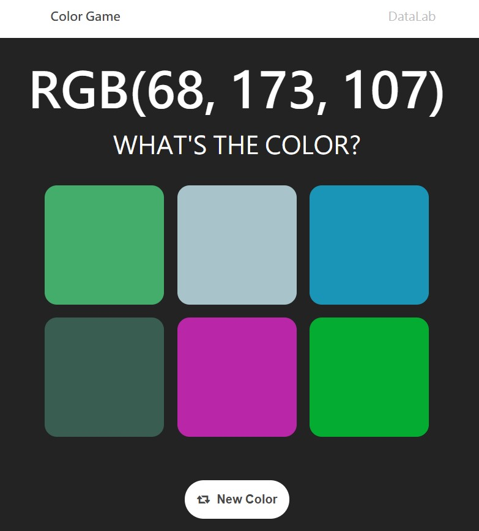

# Lab2 Submission Practice
This repository is built for practicing submissions for assignments and projects <b>again</b>.  

In this practice, we are going to edit the color game from 3 cards to 6 cards. 

After you finish, raise your hand and TA would go to check if you edit and submit the merge request correctly. 
This will be your lab's attendance points.

## `IMPORTANT` 
After this lab, we will not help you to deal with any git problems during the lab. 
If there's nothing in your branch, you will get 0 points.
