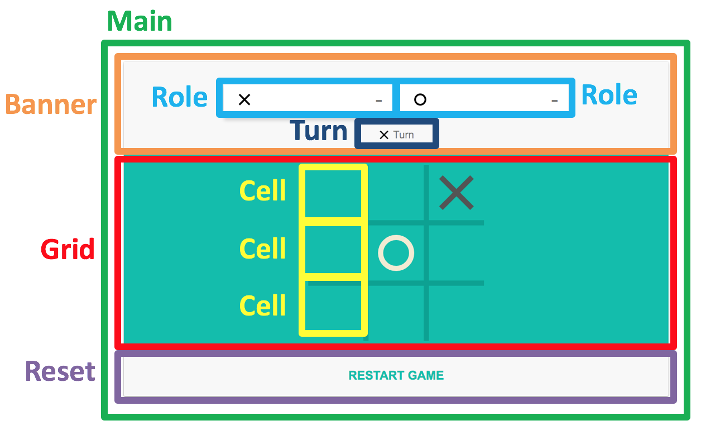

# Lab4 quiz - Tic-Tac-Toe

There are total **9 parts** of code blanked by TAs in "src" folder. 
In this lab, you should study component-based coding style. 
You need to follow the comments and fill the correct codes after the comments to make the Tic-Tac-Toe game working. 
The structure shows above. 
`To test the code, you should run "npm install" first, and run "npm run build" or "npm run watch" sequently.`

## Example
https://drive.google.com/drive/folders/1oxXU_NTsfSlJVIHyr0TqvF0SRmS8Tz2X?usp=sharing

## Grading
#### 1. banner.js reset() (10%)
#### 2. grid.js handleCellClick(firer) (10%)
#### 3. grid.js checkFinish(firer) (10%)
#### 4. grid.js checkAllOccupied() (10%)
#### 5. main.js constructor(root) (10%)
#### 6. main.js handleCellClick() (10%)
#### 7. main.js handleRestClick() (10%)
#### 8. reset.js (20%)
#### 9. role.js setScore() (10%)

`You shoud not modify the existing code or add your own function or file, except "8. reset.js".`

## Submission
Open a new merge request when you finished your quiz.  
Submission must before 4/9 17:20. 
LATE-SUBMISSION WILL NOT BE ACCEPTED!!! 

## `IMPORTANT` 
From now on, we will not help you to deal with any git problems during the quiz. 
If there's nothing in your branch, you will get 0 points.
