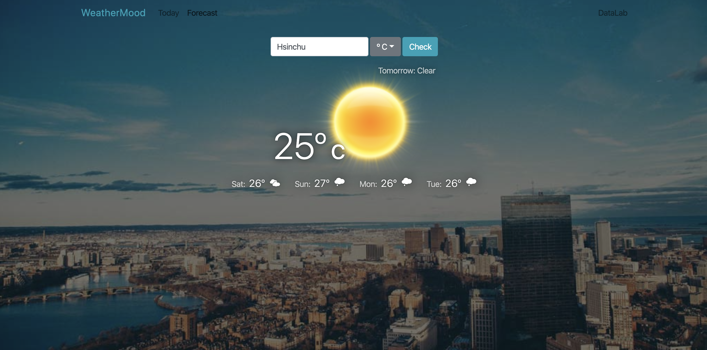

# Lab5 Assignment - React Weather Forecast

## Grading
You can use the data in the 5 day / 3 hour api or use 16 day / daily forecast data.

If you are not using OpenWeatherMap API to get weather data, you will get 0 points. 

1.  (20%) Present weather of the first day on top of the weather table correctly.
2.  Present weather of the second to the fifth day in the weather table component (total 60%)
  - (10%) Using icon from http://websygen.github.io/owfont/
  - (20%) Display weekdays (Mon, Tue, Wed, ...) correctly.
  - (30%) Display temperature correctly.
3. (20%) Responsive : Show only the second to the third day in the weather table component on portrait mobile devices.

## Bonus:
1. (30%) Store searched cities in cookie, for Today and Forecast

## Deadline
Sumbit your work before 2019/04/23 (Thur.) 23:59:59.

## Important
Start from this assignment, your future assignments should be completed <strong>in groups</strong> 
Name your merge request as Team<your_team_number>_submission