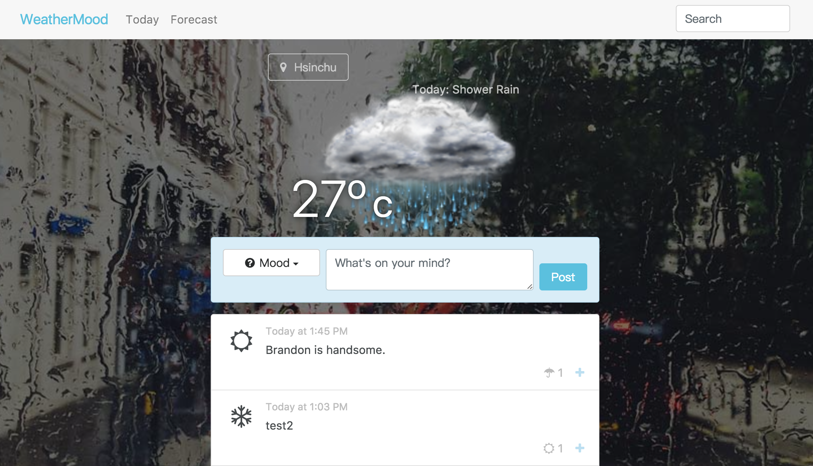
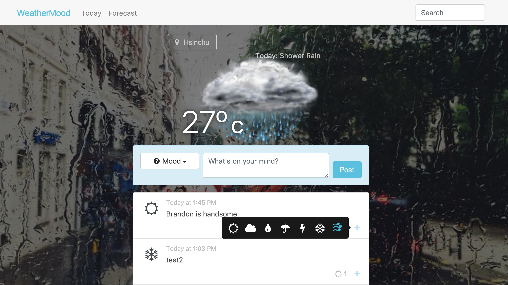
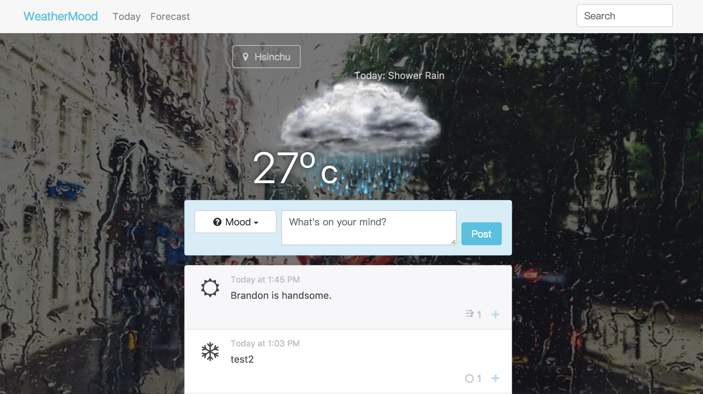
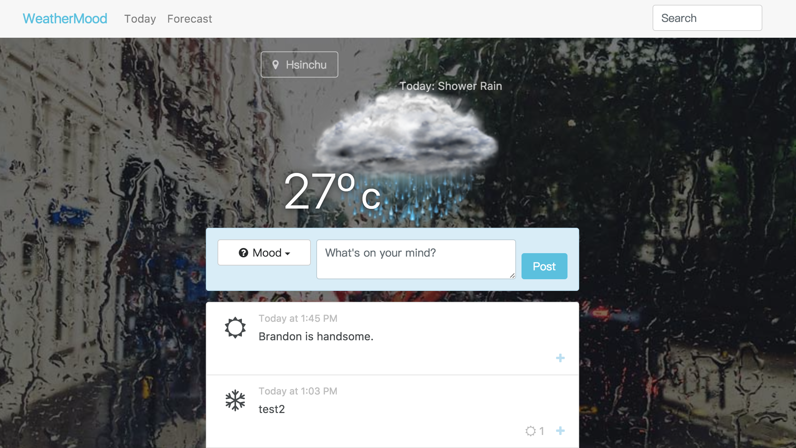

# Lab 6 - Weathermood Post

This Lab demonstrate the post function of weathermood website, where users can post articles and vote for different weather icons.

For now, single user can vote repeatedly. You are asked to change the function that single user can vote to a post only once.  
Here are the requirements :

1. Modify the code to let user can vote to a post only once.
2. If user votes different mood on the same post, the vote mood will change to the new mood. (50%)
3. If user votes the same mood on the same post, the vote mood will be deleted. (50%)

### Hint : you may need to store some user data in cookie or local storage since there is no server now.

### Flow chart
When user first votes Rains.  

When user votes Windy repeadly.  

Vote mood will be changed to Windy.  

When user votes Windy repeadly.  

Vote mood will be deleted.  

## Submission
Open a new merge request when you finished your quiz.  
Submission must before 4/23 23:59. 
LATE-SUBMISSION WILL NOT BE ACCEPTED!!! 